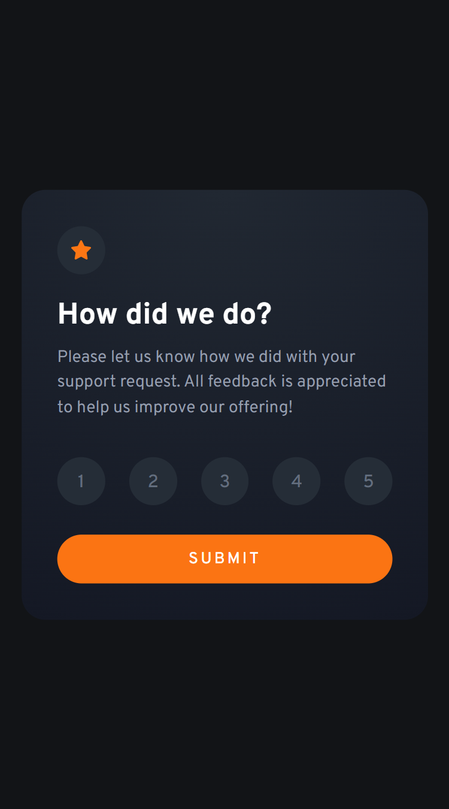

# Frontend Mentor - Interactive rating component solution

This is a solution to the [Interactive rating component challenge on Frontend Mentor](https://www.frontendmentor.io/challenges/interactive-rating-component-koxpeBUmI). Frontend Mentor challenges help you improve your coding skills by building realistic projects. 

## Table of contents

- [Overview](#overview)
  - [The challenge](#the-challenge)
  - [Screenshot](#screenshot)
  - [Links](#links)
  - [Built with](#built-with)
- [Author](#author)

## Overview

### The challenge

Users should be able to:

- View the optimal layout for the app depending on their device's screen size
- See hover states for all interactive elements on the page
- Select and submit a number rating
- See the "Thank you" card state after submitting a rating

### Screenshot

Desktop View

Mobile View

### Links

- Solution URL: [Solution](https://www.frontendmentor.io/solutions/faq-accordion-card-ZRNKpuudS)
- Live Site URL: [Live Site](https://sansarj17.github.io/FM-InteractiveRatingComponent/)

### Built with

- CSS Grid
- CSS Flexbox
- CSS custom properties
- Modern JS(ES6)

## Author

- Github - [@sansarj17](https://github.com/sansarj17/)
- Frontend Mentor - [@sansarj17](https://www.frontendmentor.io/profile/sansarj17)
